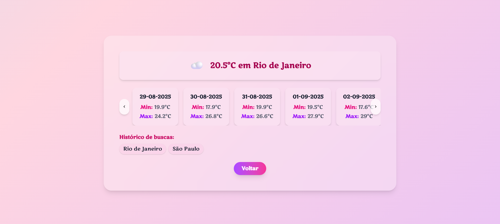

# 🌆 Termômetro Urbano  

Um aplicativo de previsão do tempo desenvolvido em **React + Vite +
TailwindCSS**.\
Permite buscar a previsão do tempo de múltiplas cidades em tempo real,
utilizando a **API Open-Meteo**.

------------------------------------------------------------------------

## 🚀 Funcionalidades  

- 🔍 Buscar a temperatura atual de qualquer cidade  
- 📅 Exibir previsão mínima e máxima dos próximos dias  
- 🕒 Histórico de buscas para fácil reutilização  
- 🌈 Interface animada e responsiva  
- 💾 Cache local (LocalStorage) para economizar chamadas à API  

------------------------------------------------------------------------

## 🛠️ Tecnologias usadas  

- [React + Vite](https://vitejs.dev/) ⚡  
- [TypeScript](https://www.typescriptlang.org/) 🔷  
- [TailwindCSS](https://tailwindcss.com/) 🎨  
- [Jest + Testing Library](https://testing-library.com/) 🧪  
- [Open-Meteo API](https://open-meteo.com/) ☁️

------------------------------------------------------------------------

## 📦 Instalação

1.  Clone este repositório:

    ``` bash
    git clone https://github.com/SeuUsuario/clima-app.git
    ```

2.  Entre no diretório do projeto:

    ``` bash
    cd clima-app
    ```

3.  Instale as dependências:

    ``` bash
    yarn install
    ```

4.  Inicie o servidor de desenvolvimento:

    ``` bash
    yarn dev
    ```

------------------------------------------------------------------------

## 🧪 Testes

Para rodar os testes unitários:

``` bash
yarn test
```

------------------------------------------------------------------------

## Capturas de Tela 📸

<div style="display: flex; justify-content: center; gap: 40px;">
  
  
</div>

------------------------------------------------------------------------

## 👩‍💻 Autora

Desenvolvido por **Nathalia Carvalho** 🚀

------------------------------------------------------------------------

## 📜 Créditos

<a href="https://www.flaticon.com/free-icons/climate-change" title="climate change icons">
  Climate change icons  - Flaticon
</a>

